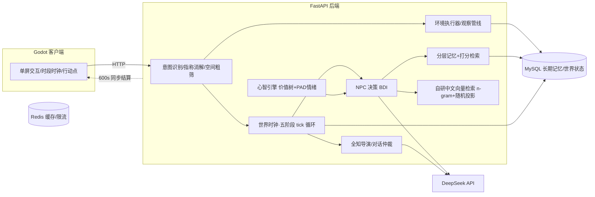

# 黄金乡谋杀案（Golden Murder）

一款由 LLM 驱动 NPC 的**涌现式叙事侦探游戏**：一场晚宴上即将发生谋杀案，庄园里的每个 NPC 都由大模型扮演——他们有自己的日程、目标、记忆和心智，世界以 10 分钟一格的 tick 持续推进。即使玩家什么都不做，剧情也会自然走向案发；玩家做的每一件事，都可能让世界偏离既定轨迹。

- 游戏客户端：Godot 4.6
- NPC 世界模拟后端：Python + FastAPI + MySQL + Redis
- 大模型：DeepSeek（OpenAI 兼容接口，可替换）

## 它和普通"AI 对话游戏"的区别

| 常见做法 | 本项目 |
|---|---|
| 玩家发消息 → NPC 回一句，没有世界状态 | 玩家行动 → 意图识别 → 世界状态真实变更 → NPC 感知到变化 |
| NPC 只在被打断时"活"一下 | 全部 NPC 按 BDI 架构（信念-愿望-意图）在每 tick 自主规划、行动、受阻重规划 |
| 记忆 = 把聊天记录塞回 prompt | 分层情节记忆 + 打分检索（相关度/重要度/时近/在场），重要性会饱和、检索会越界 |
| 多人交互靠硬编码剧本 | 同 tick 多人意图冲突交由"全知导演"AI 仲裁，机械动作纯代码裁定 |

## 系统架构



一次 tick 的五阶段循环：**计划执行**（零 LLM，纯状态变更）→ **受阻重规划** → **多 NPC 并行 LLM 决策**（线程池）→ **全知仲裁**（意图碰撞裁定，快照-决策-提交分离）→ **tick 推进**（世界时钟 +1）。一天 = 144 tick，剧情在第 99 tick 处有坏结局锚点。

## 目录结构

```
├── client/golden-murder-client/   # Godot 4.6 工程（autoload 三单例 + 单屏主场景 + 人物/地点 JSON）
├── server/
│   ├── app/                       # FastAPI 后端（28 个模块：决策/记忆/心智/仲裁/空间/环境…）
│   ├── sql/                       # init.sql 建库建表 + migrations + 种子数据
│   ├── scripts/                   # reseed.py 灌库（含向量回填与质检）、run_migration.py
│   ├── worlds/                    # 世界模组包（golden 正式剧情 / test 测试世界）
│   ├── requirements.txt
│   ├── .env.example               # 配置模板（复制为 .env 使用）
│   └── start_server.bat           # 一键启动后端
└── README.md
```

## 快速开始

### 环境要求

- Python 3.11+
- MySQL 8.x
- Redis 6.x+
- Godot 4.6（仅运行客户端）
- 一个 DeepSeek API Key（[platform.deepseek.com](https://platform.deepseek.com)）

### 1. 配置并启动后端

```bat
cd server
python -m venv .venv && .venv\Scripts\activate
pip install -r requirements.txt

copy .env.example .env
::  编辑 .env：填入 LLM_API_KEY，以及 MySQL / Redis 的本机密码

:: 建库建表（init.sql 含 CREATE DATABASE）
mysql -uroot -p < sql\init.sql

:: 依次执行 8 个迁移（001 → 008）
for %f in (sql\migrations\*.sql) do python scripts\run_migration.py %f

:: 灌入世界种子（幂等，含向量回填 + 行数对账 + 种子质检）
python scripts\reseed.py

:: 启动（或直接双击 start_server.bat；可用环境变量 PYTHON_EXE 指定解释器）
python -m uvicorn app.main:app --host 127.0.0.1 --port 8000
```

启动成功后访问 `http://127.0.0.1:8000/health` 应返回正常状态。

### 2. 启动客户端

用 Godot 4.6 打开 `client/golden-murder-client/project.godot`，直接运行（F5）。客户端会**自动拉起后端进程并等待就绪**，也可以先手动启动后端再开游戏。

### 3. 玩法

- 主菜单选择世界：`golden`（正式剧情）或 `test`（测试世界，单房间双 NPC，适合快速验证）
- 单屏交互：点击地点移动、点击 NPC 对话，行动消耗行动点；世界时间分清晨→午夜六个时段
- 你的每句话、每个动作都会被在场的 NPC 记住、传播，并影响他们的计划

## 技术要点

- **BDI 决策**：每个 NPC 维护计划（plans 表，多步骤 steps JSON 契约），行动受阻时由重规划器生成新步骤
- **分层记忆**：情节记忆写入 + 重要性阈值召回，检索打分含相关度/重要度/时近/在场加成四因子
- **心智引擎**：价值树 + PAD 情绪模型，实现为纯函数库（同样输入必得同样输出，可单测可回放）
- **全知仲裁**：同 tick 内多个 NPC 的意图碰撞，机械动作纯代码裁定，社会性动作交全知导演 LLM 集体裁决
- **自研向量检索**：中文 n-gram 哈希 + numpy 随机投影，零外部 embedding 服务依赖；`VectorStore` 抽象基类可插拔升级
- **模组化**：一个世界 = 一份 manifest + 提示词/语气/情绪词表配置（`worlds/`），不改引擎代码即可替换整个游戏内容

## 已知限制

- NPC 决策依赖 LLM，单 tick 全员结算在高配额下可能需要等待（客户端超时设为 600s 兜底）
- 向量检索为轻量自研实现，语义检索精度与 BGE-M3 等专用模型有差距（接口已抽象，可替换）
- 需要 Windows 环境运行启动脚本（.bat）；其他平台手动执行等价命令即可

## License

[MIT](LICENSE)
